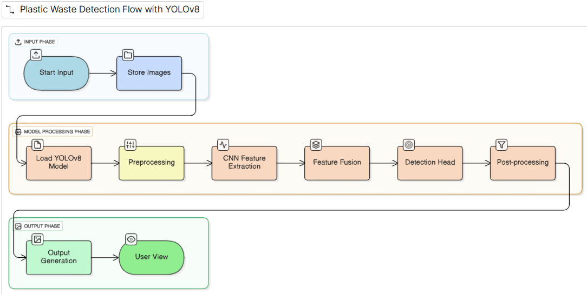

# Automated-Plastic-Detection-in-Rivers-using-YOLOv8
This project detects underwater waste using YOLOv8, enhances image clarity with Dark Channel Prior algorithm, and classifies water quality using XGBoost based on EPA and WHO standards.
# Underwater Waste Detection Using YOLOv8 and Water Quality Assessment

## 📖 Description  
This project detects underwater waste using **YOLOv8**, enhances image clarity with the **Dark Channel Prior algorithm**, and classifies water quality using an **XGBoost model** based on EPA and WHO standards. It helps monitor pollution and assess whether water is fit for use or safe for aquatic life.

---

## 🚀 Features  
- Underwater waste detection with YOLOv8  
- Underwater image enhancement using Dark Channel Prior  
- Water quality classification with XGBoost  
- Aquatic habitat assessment using rule-based system  

---

## 🛠 Tech Stack  
- Python  
- YOLOv8 (Ultralytics)  
- Dark Channel Prior Algorithm  
- XGBoost  
- Pandas, NumPy, OpenCV, Matplotlib  

---

## 🔄 Workflow  


---

## ⚙️ Installation / How to Run  

```bash
# Clone the repository
git clone https://github.com/your-username/Underwater-Waste-Detection.git

# Navigate to project folder
cd Underwater-Waste-Detection

# Install dependencies
pip install -r requirements.txt

# Run inference
python inference.py
```

---

## 📂 Dataset  
- Waste detection model trained on **5,000 underwater images**  
- Water classification model trained on a dataset with **6M+ rows**  

---

## 📸 Results  

### Denoised Images (Dark Channel Prior)


### Detection Output (YOLOv8)


---

## 🔮 Future Scope  
- Real-time underwater drone integration  
- Support for more waste and pollutant categories  

